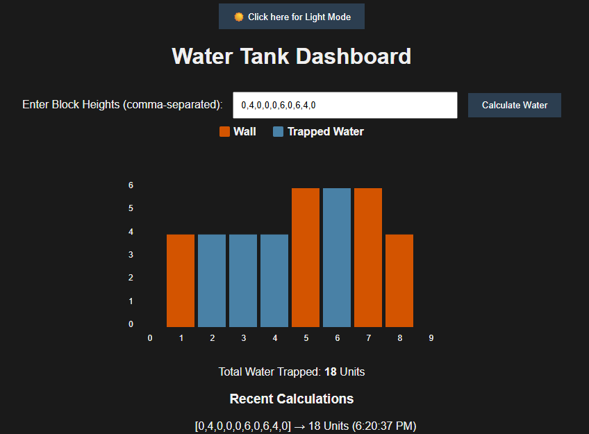

# 🚰 Water Tank: Trapping Rain Water Visualizer

A high-performance web dashboard designed to solve and visualize the **Trapping Rain Water** problem—a classic algorithmic challenge in data science and software engineering.

## 🎯 Project Overview
This application provides an interactive platform to compute the total units of water that can be trapped between blocks of varying heights. It bridges the gap between complex algorithmic logic and front-end data visualization.

### Key Features:
* **Dynamic SVG Visualization:** Renders block heights and water levels using Scalable Vector Graphics for crisp, high-quality rendering.
* **Smooth Animations:** Uses CSS transitions to simulate the "filling" of the tank, enhancing the User Experience (UX).
* **Interactive Tooltips:** Real-time data feedback on hover, showing index-specific wall and water height.
* **Data Persistence:** Integrates `localStorage` to maintain a history of recent calculations even after browser refreshes.
* **Dark Mode Support:** A modern, accessible UI with a theme toggle for varied lighting conditions.

## 🛠️ Technical Stack
* **Frontend:** Vanilla JavaScript (ES6+), HTML5, CSS3.
* **Visualization:** SVG (Scalable Vector Graphics).
* **Storage:** Web Storage API (`localStorage`).

## 🧠 Algorithmic Deep Dive
The solution utilizes the **Two-Pointer / Pre-computation** approach to achieve optimal efficiency.

### Complexity Analysis:
* **Time Complexity:** $O(n)$
    * The algorithm performs three linear passes over the input array.
* **Space Complexity:** $O(n)$
    * We maintain auxiliary arrays (`leftMax` and `rightMax`) to store boundary heights.

### How It Works:
For any given block at index *i*, the water trapped is determined by:
water[*i*] = max(0, min(max_left, max_right) - height[*i*])

* **height[*i*]:** The height of the current bar (or tower) at index *i*.

* **max_left:** The maximum height of any bar to the left of index *i* (including index 0).

* **max_right:** The maximum height of any bar to the right of index *i* (including the last element).

* **min(max_left, max_right):** This determines the water level; water can only fill up to the height of the shorter of the two surrounding walls.

* **min(max_left, max_right) - height[*i*]:** This calculates the depth of the water above the current bar. If height[*i*] is taller than the water level, the result would be negative.

* **max(0, ...):** This ensures that if the calculation results in a negative number (meaning the current bar is a peak or higher than the water level), it's treated as 0 water trapped at that spot. 

## 🚀 How to Run Locally
1. Clone the repository: `git clone https://github.com/AshwiniMurugappan/Water-Tank-Problem.git`
2. Open `index.html` in any modern web browser.
